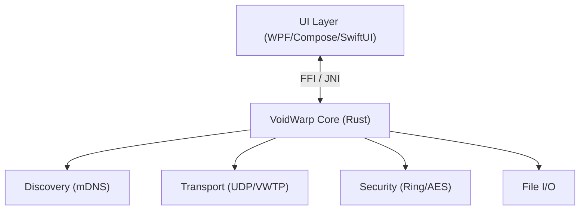

# VoidWarp 🌌

[](https://github.com/XenithCode/VoidWarp/actions/workflows/ci.yml)
[](LICENSE)

**VoidWarp** 是一个高性能、跨平台的局域网安全文件传输工具。旨在提供比 AirDrop 更广泛的设备支持，同时保持极高的传输速度和安全性。

---

## ✨ 主要功能 (Features)

| 能力 | 说明 |
|------|------|
| 🚀 **极速传输** | 基于 UDP 的自定义协议 (VWTP)，拥塞控制与重传机制，充分利用局域网带宽 |
| 🔒 **端到端加密** | ECDH 密钥交换 + AES-256 加密，传输内容不落明文 |
| 🔍 **自动发现** | mDNS + 多网卡 UDP 广播，零配置发现周围设备（Android ↔ Windows 互发现） |
| 📱 **全平台** | **Windows**（WPF 暗色主题）、**Android**（Jetpack Compose），macOS / iOS 规划中 |

## 🏗️ 架构 (Hybrid Core)

- **核心层 (Rust)**：网络传输、加密、设备发现、文件 I/O，内存安全且跨平台一致高性能。
- **UI 层 (Native)**：WPF（Windows）、Jetpack Compose（Android）、SwiftUI（计划），保证体验与系统集成。

---

## 🛠️ 安装与使用 (Usage)

### Windows

- **安装包**：从 [Releases](https://github.com/XenithCode/VoidWarp/releases) 下载 `VoidWarp-Windows-x64-Setup.exe` 或 `VoidWarp-Windows-x64.zip`，解压后运行 `VoidWarp.Windows.exe` 或 `install.bat` 创建快捷方式。
- **Android 扫不到本机**：以管理员身份运行解压目录下的 `setup_firewall.bat` 配置防火墙。

### 源码构建 (Build from Source)

**环境要求**：Rust (Stable)、Windows 需 Visual Studio 2022（.NET Desktop + C++），Android 需 Android Studio（NDK）。

```bash
git clone https://github.com/XenithCode/VoidWarp.git
cd VoidWarp
```

| 目标 | 命令 |
|------|------|
| Rust 核心 | `cd core && cargo build --release` |
| Windows 客户端 | `cd platforms/windows && dotnet build -c Release`，运行 `bin/Release/net8.0-windows/VoidWarp.Windows.exe` |
| Windows 安装包 | 根目录执行 `publish_windows.bat`，再运行 Inno Setup 编译 `platforms/windows/installer/VoidWarp.iss` 得到单文件安装包 |
| Android 客户端 | 根目录执行 `build_android.bat`，或 `platforms/android` 下运行 `gradlew assembleDebug` |

---

## 📜 许可证 (License)

Copyright © 2024 XenithCode.

本项目采用 **GNU General Public License v3.0 (GPLv3)** 许可证。

*   ✅ **自由使用**: 您可以自由下载、运行和使用本软件。
*   ✅ **源码共享**: 您可以获取、学习并修改本项目源码。
*   ⚠️ **分发要求**: 如果您分发本软件或其修改版本，必须以相同的许可证 (GPLv3) 公开您的源代码。
*   ❌ **闭源商业**: 严禁将本项目源码集成到任何闭源商业软件中。

详见 [LICENSE](LICENSE)。协议与安全设计见 [docs/protocol/](docs/protocol/)。

---

## 🏗️ 架构图



详细协议文档请参阅 [docs/protocol/PROTOCOL_SPEC.md](docs/protocol/PROTOCOL_SPEC.md)。
