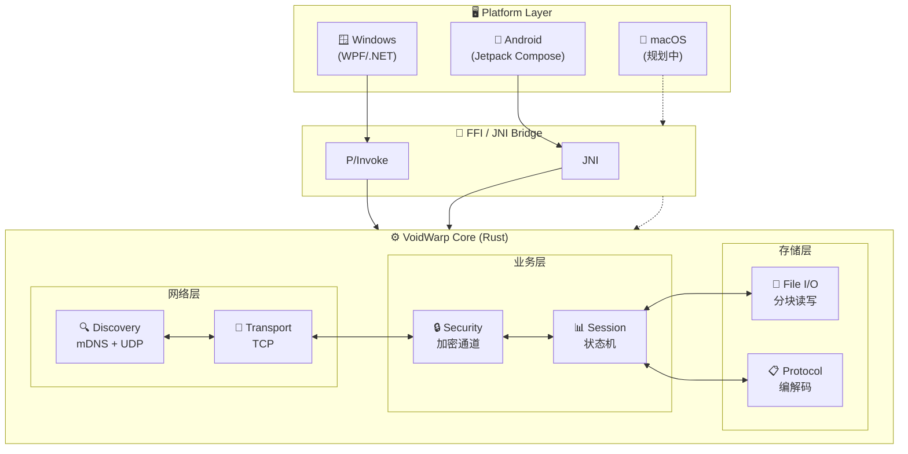
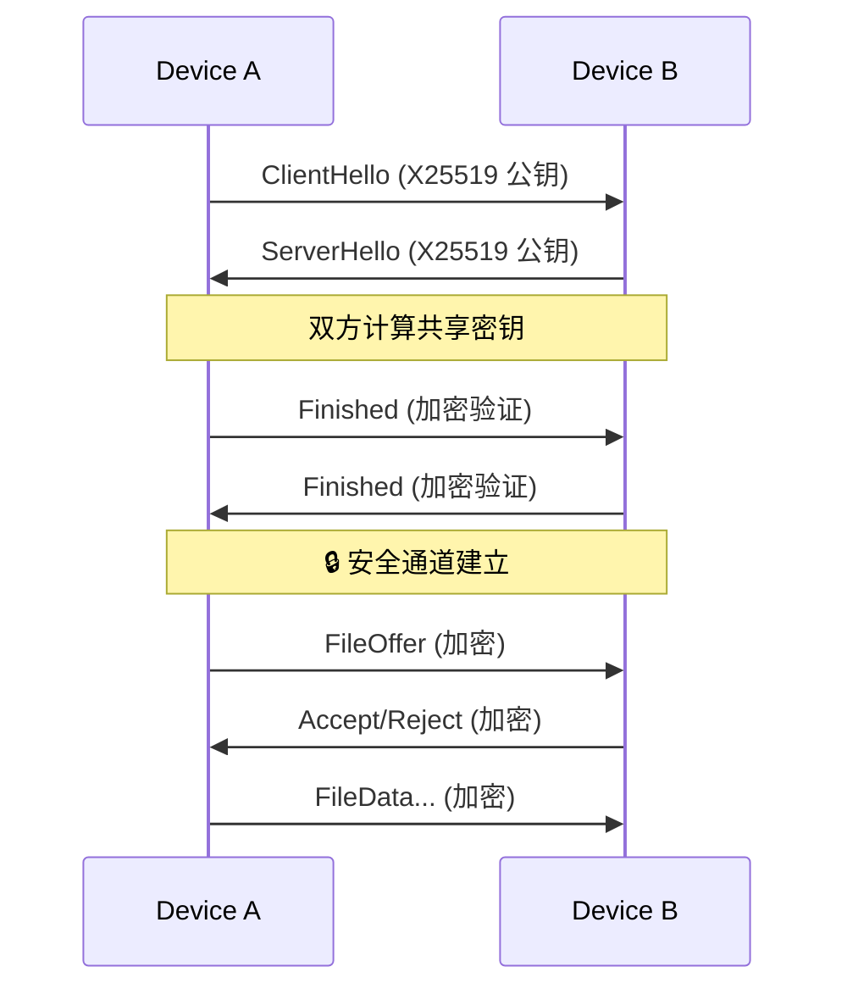
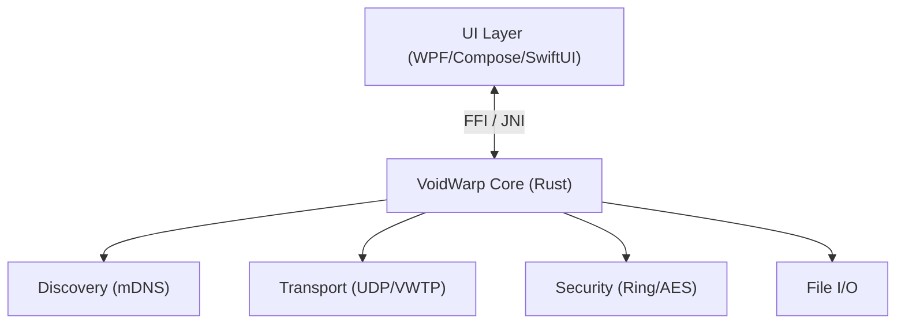

<div align="center">

# ⚡ VoidWarp 🌌

**高性能跨平台局域网文件传输工具**

[](https://github.com/XenithCode/VoidWarp/actions/workflows/ci.yml)
[](LICENSE)
[](#)
[](https://www.rust-lang.org/)

**基于 Rust 核心引擎 · 端到端加密传输 · 自动设备发现 · 统一跨平台体验**

[🌐 访问官网](https://xustalis.github.io/VoidWarp/) · [📥 下载安装](https://xustalis.github.io/VoidWarp/#download) · [📖 查看文档](#) · [🐛 报告问题](https://github.com/xustalis/voidwarp/issues)

</div>

---

## ✨ 功能亮点

| 能力 | 说明 |
|------|------|
| 🚀 **极速传输** | 基于 UDP 的自定义协议 (VWTP)，支持多文件顺序传输、拥塞控制与智能重传 |
| 🔒 **端到端加密** | ECDH 密钥交换 + AES-256-GCM 加密，传输内容全程密文 |
| 🔍 **自动发现** | mDNS + 多网卡 UDP 广播，支持手动添加 (带 IP 校验) |
| 📝 **接收记录** | 完整的历史记录管理，支持记录删除与物理文件联动删除 |
| 📂 **智能存储** | 默认保存至 `Downloads/VoidWarp`，Android 自动触发媒体扫描 |
| 🎨 **一致体验** | 跨平台统一的 Dark Cyberpunk 主题与三阶段交互流程 |

---

## 📦 快速开始

<div align="center">

### 🌐 推荐：访问官方网站下载

**前往 [VoidWarp 官网](https://xustalis.github.io/VoidWarp/) 获取最新版本和自动更新链接**

[](https://xustalis.github.io/VoidWarp/#download)

网站提供：✨ 实时版本信息 · 📥 直接下载链接 · 📖 使用指南 · 💬 常见问题解答

</div>

### 平台支持

| 平台 | 版本要求 | 下载方式 | 安装说明 |
|:----:|:--------:|:--------:|:--------:|
| 🪟 **Windows** | Windows 10+ (x64) | [安装包 (.exe)](https://xustalis.github.io/VoidWarp/#download) / [便携版 (.zip)](https://github.com/xustalis/voidwarp/releases) | 开箱即用，无需运行时 |
| 🤖 **Android** | Android 8.0+ | [APK 直装](https://xustalis.github.io/VoidWarp/#download) | 支持 ARM64/ARMv7/x86_64 |
| 📱 **iOS** | iOS 16.0+ | [源码编译](platforms/ios/) | ⚠️ **Alpha (未经过测试)** 用 Xcode 编译 |
| 🍎 **macOS** | 规划中 | - | v2.0 roadmap |

### Windows 安装

> **开箱即用** - 无需安装任何运行时环境

1. **推荐**：访问 [官网下载页](https://xustalis.github.io/VoidWarp/#download) 获取最新版本
2. 或从 [GitHub Releases](https://github.com/XenithCode/VoidWarp/releases) 下载：
   - `VoidWarp-Windows-x64-Setup.exe` （推荐，一键安装）
   - `VoidWarp-Windows-x64.zip` （便携版，解压即用）
3. 运行安装程序或直接启动 `VoidWarp.Windows.exe`
4. **防火墙配置**：如果 Android 发现不到本机，以管理员身份运行 `setup_firewall.bat`

### Android 安装

1. **推荐**：访问 [官网下载页](https://xustalis.github.io/VoidWarp/#download) 获取最新 APK
2. 或从 [GitHub Releases](https://github.com/XenithCode/VoidWarp/releases) 下载 `VoidWarp-Android.apk`
3. 允许来自未知来源的安装，直接安装即可

---

## 🏗️ 技术架构

### 架构概览

VoidWarp 采用 **Hybrid Core** 架构模式，将核心逻辑与平台 UI 解耦：



### 核心模块

| 模块 | 职责 |
|------|------|
| **Discovery** | mDNS 服务发现 (`_voidwarp._udp.local`)，UDP 广播支持，手动配对 |
| **Transport** | TCP 可靠传输，分块读写，选择性确认与重传 |
| **Security** | 握手协商，加密通道（规划中：X25519 密钥交换，AES-256-GCM 加密） |
| **Session** | 状态机驱动：`Idle → Handshaking → Transferring → Verifying → Completed` |
| **File I/O** | 分块读写，MD5 校验，断点续传支持 |
| **Protocol** | 消息编解码，文件 Offer/Accept 协议 |

### 传输协议

VoidWarp 当前使用 **TCP** 作为传输层协议，确保数据完整性和可靠性：

**传输特性**：
- **可靠传输**：利用 TCP 的顺序传输和重传机制
- **分块传输**：大文件分块读写，支持进度回报
- **校验机制**：MD5 校验确保文件完整性
- **断点续传**：支持传输中断后继续（规划中）

**未来规划**：
- 自定义 UDP 协议 (VWTP) 实现更高性能
- 拥塞控制与自适应带宽
- 选择性确认 (SACK) 减少重传

### 安全机制 (规划中)

当前版本使用基础握手协商和加密通道。完整的端到端加密将在未来版本实现：



---

## 📁 项目结构

```
VoidWarp/
├── core/                          # Rust 核心引擎
│   ├── src/
│   │   ├── lib.rs                 # 库入口
│   │   ├── ffi.rs                 # C-ABI / FFI 接口
│   │   ├── android.rs             # Android JNI 绑定
│   │   ├── discovery/             # mDNS 服务发现
│   │   ├── transport.rs           # VWTP 传输层
│   │   ├── security/              # 加密与密钥管理
│   │   ├── sender.rs              # 发送逻辑
│   │   ├── receiver.rs            # 接收逻辑
│   │   └── protocol.rs            # 消息协议编解码
│   └── Cargo.toml
│
├── platforms/
│   ├── windows/                   # Windows WPF 客户端
│   │   ├── MainWindow.xaml        # 主界面
│   │   ├── ViewModels/            # MVVM 视图模型
│   │   ├── Native/                # P/Invoke 绑定
│   │   └── installer/             # Inno Setup 安装脚本
│   │
│   └── android/                   # Android Kotlin 客户端
│       ├── app/src/main/
│       │   ├── kotlin/.../        # Jetpack Compose UI
│       │   └── jniLibs/           # 预编译 .so 库
│       └── build.gradle.kts
│
├── docs/
│   ├── architecture/              # 架构设计文档
│   └── protocol/                  # 协议规范
│
├── publish_windows.bat            # Windows 发布脚本 (自包含)
├── build_android.bat              # Android 构建脚本
└── README.md
```

---

## 🛠️ 开发者指南

### 环境要求

| 平台 | 工具 |
|------|------|
| **Rust 核心** | Rust Stable (rustup.rs) |
| **Windows 客户端** | Visual Studio 2022 (.NET Desktop + C++) |
| **Android 客户端** | Android Studio + NDK r25+ |

### 构建命令

```bash
# 克隆仓库
git clone https://github.com/XenithCode/VoidWarp.git
cd VoidWarp

# 构建 Rust 核心
cd core && cargo build --release && cd ..

# 构建 Windows 客户端 (开发模式)
cd platforms/windows && dotnet build -c Release

# 发布 Windows 安装包 (自包含，用户无需环境)
./publish_windows.bat

# 构建 Android APK
./build_android.bat
```

### 生成安装程序

```bash
# 需要先安装 Inno Setup 6: https://jrsoftware.org/isinfo.php
cd platforms/windows/installer
./build_installer.bat
# 输出: publish/output/VoidWarp-Windows-x64-vX.X.X-Setup.exe
```

---

## 🤝 贡献指南

我们欢迎所有形式的贡献！请阅读以下指南参与项目开发。

### 贡献流程

```bash
# 1. Fork 本仓库并克隆到本地
git clone https://github.com/YOUR_USERNAME/VoidWarp.git
cd VoidWarp

# 2. 创建功能分支
git checkout -b feature/your-feature-name

# 3. 开发并测试
cd core && cargo test && cd ..

# 4. 提交更改 (遵循 Commit 规范)
git commit -m "feat: add new transfer feature"

# 5. 推送并创建 Pull Request
git push origin feature/your-feature-name
```

### Commit 规范

| 类型 | 说明 |
|------|------|
| `feat` | 新功能 |
| `fix` | Bug 修复 |
| `docs` | 文档更新 |
| `refactor` | 代码重构 (非功能性) |
| `test` | 测试相关 |
| `chore` | 构建/配置变更 |

格式: `<type>: <description>` (使用英文，首字母小写)

### 代码规范

**Rust Core**:
```bash
# 提交前必须通过
cargo fmt -- --check    # 代码格式
cargo clippy -- -D warnings  # 静态分析
cargo test               # 所有测试
```

**Pull Request 要求**:
- PR 标题需清晰描述改动内容
- 如修复 Issue，请在描述中关联 (如 `Fixes #123`)
- 确保 CI 检查全部通过

### 报告问题

提交 Issue 时请包含:
- **环境**: 操作系统、VoidWarp 版本
- **复现步骤**: 详细的操作步骤
- **预期行为 vs 实际行为**
- **日志/截图** (如有)

---

## 📜 许可证 (License)

Copyright © 2024-2026 Xustalis.

本项目采用 **GNU General Public License v3.0 (GPLv3)** 许可证。

- ✅ **自由使用**: 您可以自由下载、运行和使用本软件
- ✅ **源码共享**: 您可以获取、学习并修改本项目源码
- ⚠️ **分发要求**: 分发本软件或修改版本必须以 GPLv3 公开源代码
- ❌ **闭源商业**: 严禁集成到闭源商业软件中

详见 [LICENSE](LICENSE)。协议与安全设计见 [docs/protocol/](docs/protocol/)。

---

## 🏗️ 架构图



详细协议文档请参阅 [docs/protocol/PROTOCOL_SPEC.md](docs/protocol/PROTOCOL_SPEC.md)。
