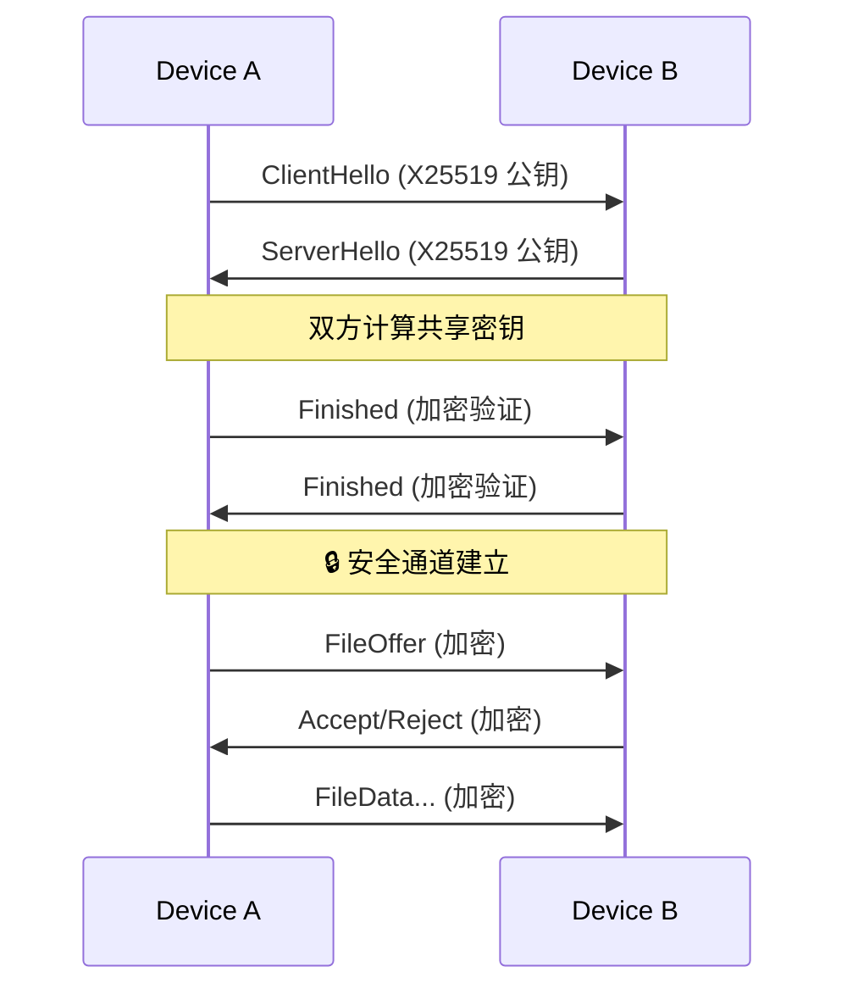

# VoidWarp 🌌

[](https://github.com/XenithCode/VoidWarp/actions/workflows/ci.yml)
[](LICENSE)

**VoidWarp** 是一个高性能、跨平台的局域网安全文件传输工具。基于 Rust 核心引擎，提供端到端加密传输、自动设备发现，以及跨 Windows、Android 等平台的一致体验。

---

## ✨ 功能亮点

| 能力 | 说明 |
|------|------|
| 🚀 **极速传输** | 基于 UDP 的自定义协议 (VWTP)，支持多文件顺序传输、拥塞控制与智能重传 |
| 🔒 **端到端加密** | ECDH 密钥交换 + AES-256-GCM 加密，传输内容全程密文 |
| 🔍 **自动发现** | mDNS + 多网卡 UDP 广播，支持手动添加 (带 IP 校验) |
| 📝 **接收记录** | 完整的历史记录管理，支持记录删除与物理文件联动删除 |
| 📂 **智能存储** | 默认保存至 `Downloads/VoidWarp`，Android 自动触发媒体扫描 |
| 🎨 **一致体验** | 跨平台统一的 Dark Cyberpunk 主题与三阶段交互流程 |

---

## 📦 快速开始

### Windows 安装

> **开箱即用** - 无需安装任何运行时环境

1. 从 [Releases](https://github.com/XenithCode/VoidWarp/releases) 下载最新版本：
   - `VoidWarp-Windows-x64-Setup.exe` (推荐，一键安装)
   - `VoidWarp-Windows-x64.zip` (便携版，解压即用)

2. 运行安装程序或直接启动 `VoidWarp.Windows.exe`

3. **如果 Android 发现不到本机**：以管理员身份运行 `setup_firewall.bat`

### Android 安装

从 [Releases](https://github.com/XenithCode/VoidWarp/releases) 下载 `VoidWarp-Android.apk` 直接安装。

---

## 🏗️ 技术架构

VoidWarp 采用 **Hybrid Core** 架构模式，将核心逻辑与平台 UI 解耦：

```
┌─────────────────────────────────────────────────────────────────┐
│                        Platform Layer                            │
│  ┌─────────────┐  ┌─────────────┐  ┌─────────────┐              │
│  │   Windows   │  │   Android   │  │    macOS    │  (计划中)    │
│  │     WPF     │  │   Compose   │  │   SwiftUI   │              │
│  └──────┬──────┘  └──────┬──────┘  └──────┬──────┘              │
│         │                │                │                      │
│         └────────────────┼────────────────┘                      │
│                          │ FFI / JNI                             │
├──────────────────────────┼───────────────────────────────────────┤
│                          ▼                                       │
│  ┌───────────────────────────────────────────────────────────┐  │
│  │                   VoidWarp Core (Rust)                     │  │
│  │                                                            │  │
│  │  ┌────────────┐  ┌────────────┐  ┌────────────┐           │  │
│  │  │ Discovery  │  │ Transport  │  │  Security  │           │  │
│  │  │   mDNS     │  │   VWTP     │  │ ECDH/AES   │           │  │
│  │  └────────────┘  └────────────┘  └────────────┘           │  │
│  │                                                            │  │
│  │  ┌────────────┐  ┌────────────┐  ┌────────────┐           │  │
│  │  │  Session   │  │  File I/O  │  │  Protocol  │           │  │
│  │  │  Manager   │  │  Chunked   │  │  Codec     │           │  │
│  │  └────────────┘  └────────────┘  └────────────┘           │  │
│  └───────────────────────────────────────────────────────────┘  │
│                        Core Layer                                │
└─────────────────────────────────────────────────────────────────┘
```

### 核心模块

| 模块 | 职责 |
|------|------|
| **Discovery** | mDNS 服务发现 (`_voidwarp._udp.local`)，多网卡广播，手动配对 |
| **Transport** | VWTP 可靠 UDP 传输协议，拥塞控制，选择性重传 (SACK) |
| **Security** | X25519 密钥交换，AES-256-GCM 加密，前向保密 |
| **Session** | 状态机驱动：`Idle → Handshaking → Transferring → Verifying → Completed` |
| **File I/O** | 分块读写，MD5 校验，断点续传支持 |
| **Protocol** | 消息编解码，文件 Offer/Accept 协议 |

### VWTP 传输协议

VoidWarp Transport Protocol 是专为局域网高速传输设计的可靠 UDP 协议：

```
┌─────────────────────────────────────────────┐
│              VWTP Packet Header             │
├──────┬──────────────┬───────────────────────┤
│ Flag │ Connection ID│    Packet Number      │
│ 1B   │     8B       │         8B            │
└──────┴──────────────┴───────────────────────┘
         │
         ▼
┌─────────────────────────────────────────────┐
│              Encrypted Payload              │
│         (AES-256-GCM Encrypted)             │
└─────────────────────────────────────────────┘
```

**协议特性**：
- **流复用**：Stream 0 用于控制消息，Stream 1+ 用于文件数据
- **选择性确认**：SACK 机制减少不必要的重传
- **拥塞控制**：类 Cubic 算法自适应带宽
- **密钥轮换**：每 1GB 数据或 1 小时自动更新密钥

### 安全机制



---

## 📁 项目结构

```
VoidWarp/
├── core/                          # Rust 核心引擎
│   ├── src/
│   │   ├── lib.rs                 # 库入口
│   │   ├── ffi.rs                 # C-ABI / FFI 接口
│   │   ├── android.rs             # Android JNI 绑定
│   │   ├── discovery/             # mDNS 服务发现
│   │   ├── transport.rs           # VWTP 传输层
│   │   ├── security/              # 加密与密钥管理
│   │   ├── sender.rs              # 发送逻辑
│   │   ├── receiver.rs            # 接收逻辑
│   │   └── protocol.rs            # 消息协议编解码
│   └── Cargo.toml
│
├── platforms/
│   ├── windows/                   # Windows WPF 客户端
│   │   ├── MainWindow.xaml        # 主界面
│   │   ├── ViewModels/            # MVVM 视图模型
│   │   ├── Native/                # P/Invoke 绑定
│   │   └── installer/             # Inno Setup 安装脚本
│   │
│   └── android/                   # Android Kotlin 客户端
│       ├── app/src/main/
│       │   ├── kotlin/.../        # Jetpack Compose UI
│       │   └── jniLibs/           # 预编译 .so 库
│       └── build.gradle.kts
│
├── docs/
│   ├── architecture/              # 架构设计文档
│   └── protocol/                  # 协议规范
│
├── publish_windows.bat            # Windows 发布脚本 (自包含)
├── build_android.bat              # Android 构建脚本
└── README.md
```

---

## 🛠️ 开发者指南

### 环境要求

| 平台 | 工具 |
|------|------|
| **Rust 核心** | Rust Stable (rustup.rs) |
| **Windows 客户端** | Visual Studio 2022 (.NET Desktop + C++) |
| **Android 客户端** | Android Studio + NDK r25+ |

### 构建命令

```bash
# 克隆仓库
git clone https://github.com/XenithCode/VoidWarp.git
cd VoidWarp

# 构建 Rust 核心
cd core && cargo build --release && cd ..

# 构建 Windows 客户端 (开发模式)
cd platforms/windows && dotnet build -c Release

# 发布 Windows 安装包 (自包含，用户无需环境)
./publish_windows.bat

# 构建 Android APK
./build_android.bat
```

### 生成安装程序

```bash
# 需要先安装 Inno Setup 6: https://jrsoftware.org/isinfo.php
cd platforms/windows/installer
./build_installer.bat
# 输出: publish/output/VoidWarp-Windows-x64-vX.X.X-Setup.exe
```

---

## 📜 许可证

Copyright © 2024-2026 Xustalis.

本项目采用 **GNU General Public License v3.0 (GPLv3)** 许可证。

- ✅ **自由使用**: 您可以自由下载、运行和使用本软件
- ✅ **源码共享**: 您可以获取、学习并修改本项目源码
- ⚠️ **分发要求**: 分发本软件或修改版本必须以 GPLv3 公开源代码
- ❌ **闭源商业**: 严禁集成到闭源商业软件中

详见 [LICENSE](LICENSE)。协议与安全设计见 [docs/protocol/](docs/protocol/)。

---

## 🔗 相关文档

- [架构设计](docs/architecture/ARCHITECTURE.md)
- [VWTP 协议规范](docs/protocol/PROTOCOL_SPEC.md)
- [安全规范](docs/protocol/SECURITY.md)
- [消息格式](docs/protocol/MESSAGE_FORMAT.md)
