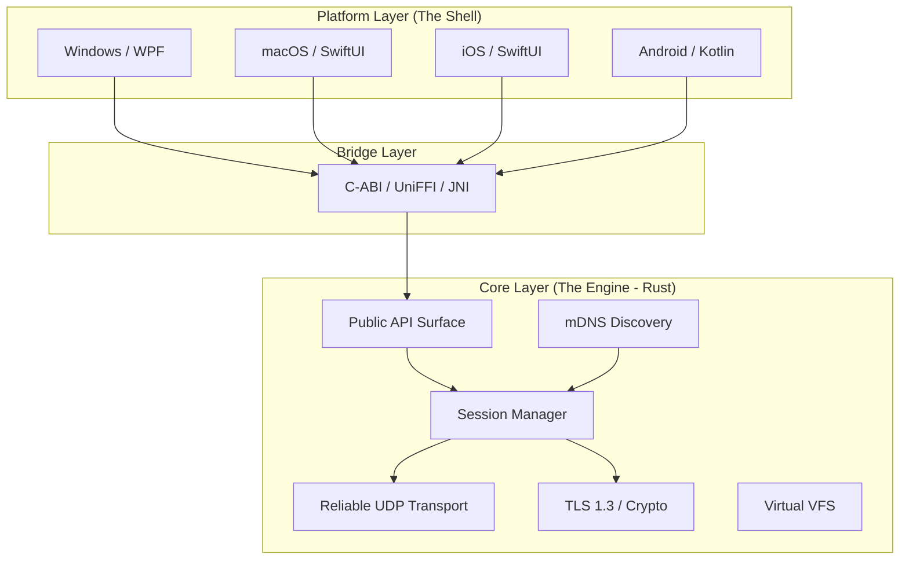

# VoidWarp System Architecture

## 1. Architectural Style: Hybrid Core
VoidWarp adopts a **Hybrid Core Architecture** (also known as the "Humble View" pattern at a system level). 
- **The Engine (Rust)**: Contains 100% of the business logic, networking, security, and state management. It is platform-agnostic.
- **The Shell (Native UI)**: Thin compatibility layers that handle rendering and OS-specific events (File System dialogs, Notifications, Lifecycle).

## 2. Core Modules (Rust)

### 2.1 Network Transport (`core::transport`)
- **Protocol**: Custom Reliable UDP (inspired by QUIC).
- **Features**:
  - Connection ID management.
  - Packet framing and sequencing.
  - Congestion Control (Cubic or BBR-like).
  - Stream multiplexing (Control Stream + Data Streams).

### 2.2 Discovery (`core::discovery`)
- **Mechanism**: Multicast DNS (mDNS).
- **Service Type**: `_voidwarp._udp.local`.
- **Payload**: TXT records containing DeviceID, Model, Status.

### 2.3 Security (`core::security`)
- **Handshake**: Spake2+ or similar PAKE for pairing (using 6-digit code).
- **Encryption**: ChaCha20-Poly1305 or AES-256-GCM for transport encryption.
- **Identity**: Ed25519 keypairs for device identity.

### 2.4 Session Management (`core::session`)
- State machine driving the transfer flow:
  - `Idle` -> `Handshaking` -> `Transferring` -> `Verifying` -> `Completed`.

## 3. Data Flow

### 3.1 File Send Request
1. **UI**: User drags file -> calls `core_send_files(paths)`.
2. **Core**:
   - Validates paths.
   - Calculates total size.
   - Generates 'Offer' message.
3. **Network**: Sends 'Offer' to Target Peer via Control Stream.
4. **Target Core**: Receives 'Offer' -> Call callback `on_transfer_request`.
5. **Target UI**: Shows "Accept/Decline" dialog.

## 4. Cross-Platform Strategy
- **Shared Code**: >90% of logic in `core/`.
- **Concurrency**: `tokio` runtime used internally. APIs exposed to UI are callback-based or reactive observable streams to avoid blocking the UI thread.
