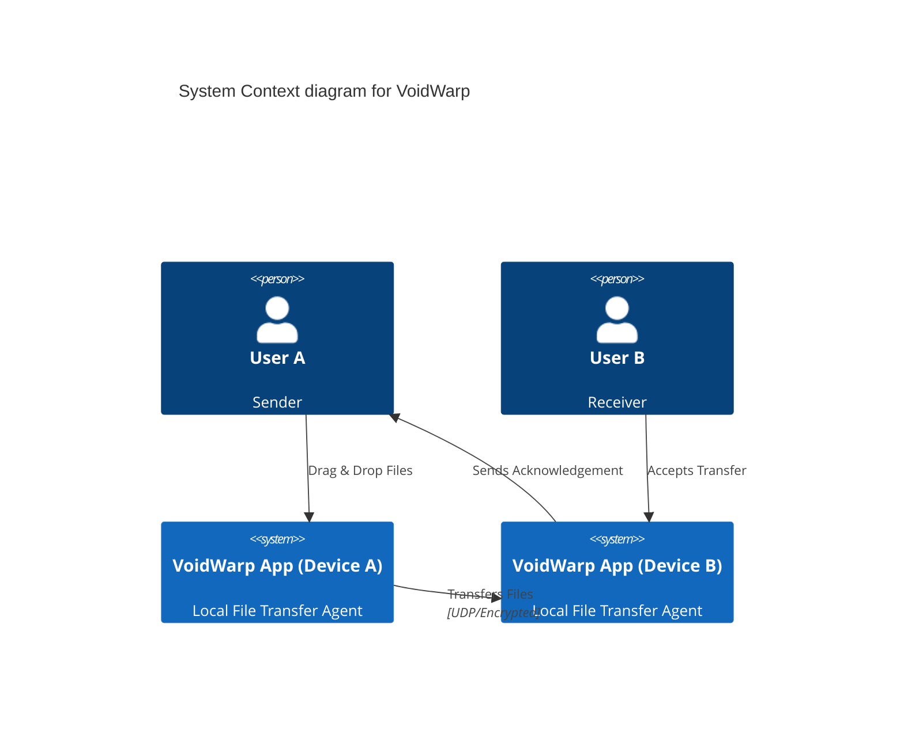
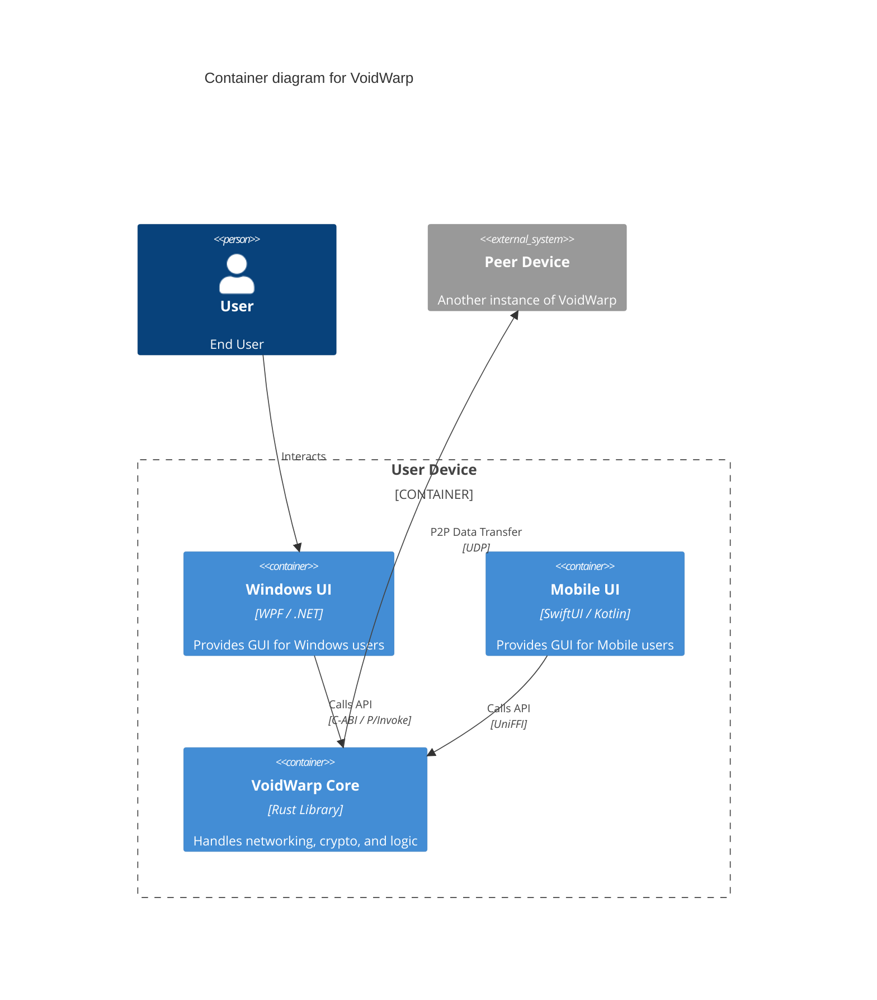
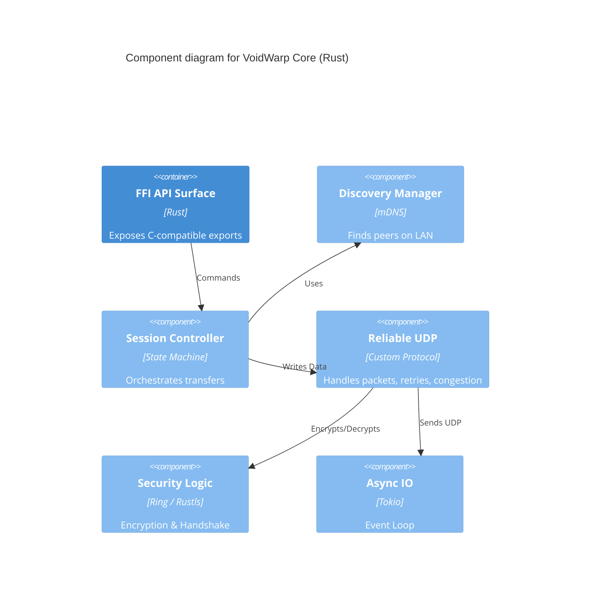

# VoidWarp C4 Model

## Level 1: System Context Diagram

```mermaid
C4Context
    title System Context diagram for VoidWarp

    Person(userA, "User A", "Sender")
    Person(userB, "User B", "Receiver")

    System(voidwarpA, "VoidWarp App (Device A)", "Local File Transfer Agent")
    System(voidwarpB, "VoidWarp App (Device B)", "Local File Transfer Agent")

    Rel(userA, voidwarpA, "Drag & Drop Files")
    Rel(voidwarpA, voidwarpB, "Transfers Files", "UDP/Encrypted")
    Rel(voidwarpB, userA, "Sends Acknowledgement")
    Rel(userB, voidwarpB, "Accepts Transfer")
```

## Level 2: Container Diagram

```mermaid
C4Container
    title Container diagram for VoidWarp

    Person(user, "User", "End User")

    Container_Boundary(device, "User Device") {
        Container(ui_win, "Windows UI", "WPF / .NET", "Provides GUI for Windows users")
        Container(ui_mobile, "Mobile UI", "SwiftUI / Kotlin", "Provides GUI for Mobile users")
        
        Container(core, "VoidWarp Core", "Rust Library", "Handles networking, crypto, and logic")
        
        Rel(ui_win, core, "Calls API", "C-ABI / P/Invoke")
        Rel(ui_mobile, core, "Calls API", "UniFFI")
    }

    System_Ext(peer, "Peer Device", "Another instance of VoidWarp")

    Rel(user, ui_win, "Interacts")
    Rel(core, peer, "P2P Data Transfer", "UDP")
```

## Level 3: Component Diagram (Core Library)

```mermaid
C4Component
    title Component diagram for VoidWarp Core (Rust)

    Container(api, "FFI API Surface", "Rust", "Exposes C-compatible exports")
    
    Component(discovery, "Discovery Manager", "mDNS", "Finds peers on LAN")
    Component(session, "Session Controller", "State Machine", "Orchestrates transfers")
    Component(transport, "Reliable UDP", "Custom Protocol", "Handles packets, retries, congestion")
    Component(crypto, "Security Logic", "Ring / Rustls", "Encryption & Handshake")
    Component(io, "Async IO", "Tokio", "Event Loop")

    Rel(api, session, "Commands")
    Rel(session, discovery, "Uses")
    Rel(session, transport, "Writes Data")
    Rel(transport, crypto, "Encrypts/Decrypts")
    Rel(transport, io, "Sends UDP")
```
